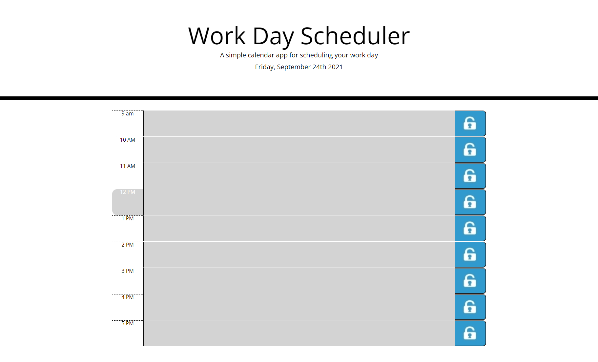

# Work-Day-Planner

## Function
I am using a daily planner to create a schedule and when I open the planner, the current day is displayed at the top of the calendar.
WHEN I scroll down, I am presented with timeblocks for standard business hours.
WHEN I view the timeblocks for that day, then each timeblock is color coded to indicate whether it is in the past, present, or future.
WHEN I click into a timeblock, then I can enter an event

## Demonstration

## Resources
[Moments.js Documentation](https://momentjs.com/docs)

[Bootstrap Documentation](https://getbootstrap.com/docs/5.1/getting-started/introduction/)

[Jquery Documentation](https://api.jquery.com/)

https://github.com/yoojeenkim/Work-Day-Planner

https://yoojeenkim.github.io/Work-Day-Planner/